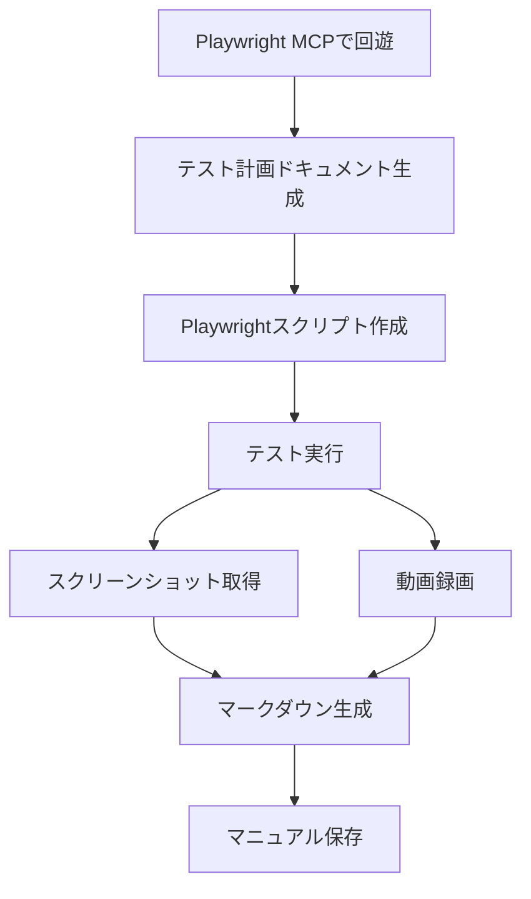

# E2Eテストコードからのユーザー操作マニュアル自動生成施策

## 概要

E2Eテストコードの変更時に自動的にユーザー操作マニュアル（動画・テキスト）を更新することで、保守コストを削減し、ドキュメントの正確性を確保するシステムを構築する。

## 背景と課題

### 現状の課題
- **保守コストの高さ**: 仕様変更時にE2Eテストコードとマニュアルの両方を更新する必要がある
- **人的ミスのリスク**: マニュアル更新漏れによるドキュメントと実装の乖離
- **更新タイミングのずれ**: テストコード変更後、マニュアル更新が後回しになりがち

### 解決すべき要件
- E2Eテスト実行時に自動でマニュアル生成
- 動画・テキストの両フォーマット対応
- CI/CDパイプラインとの統合
- 既存テストコードへの影響最小化

## 提案アプローチ

### 基本フロー


### 1. Playwright MCPを使用したアプリケーション回遊
- **目的**: 既存テストコードなしのまっさらな状態からの計画作成
- **利点**: AIエージェントが新規でテスト計画を作成
- **実装**: MCPツールを活用した操作フックの実装

### 2. テスト計画ドキュメント作成
- **操作区切り**: 「商品の追加方法」などの機能単位での計画
- **撮影タイミング**: スクリーンショット取得ポイントの明記
- **動画録画**: 録画開始・終了タイミングの指定
- **保存先**: `/_docs/plan/`

### 3. Playwrightスクリプト生成
- **自動生成**: テスト計画ドキュメントからスクリプト作成
- **スクリーンショット**: 計画されたタイミングでの撮影
- **動画設定**: Playwrightのvideo機能有効化
- **保存先**: `/_docs/script/`

### 4. テスト実行とメディア取得
- **同時実行**: テスト実行中にスクリーンショットと動画を同時取得
- **シンプル録画**: 編集処理なしのそのまま録画
- **保存先**: 画像 `/_docs/images/`、動画 `/_docs/movies/`

### 5. マニュアル自動生成
- **AI支援**: テスト計画とメディアファイルから自動生成
- **リンク設定**: 画像・動画への適切なリンク記載
- **保存先**: `/_docs/manuals/`

## 技術アーキテクチャ

### ディレクトリ構造
```
_docs/
├── plan/          # テスト計画ドキュメント
├── images/        # スクリーンショット保存先
├── script/        # Playwrightテストスクリプト
├── movies/        # 動画ファイル保存先
└── manuals/       # 生成されたマニュアル
```

### 主要コンポーネント

#### 1. AI Test Plan Generator (新規)
```typescript
interface AITestPlanGenerator {
  exploreApplication(mcpSession: MCPSession): Promise<ApplicationStructure>
  generateTestPlan(feature: string, structure: ApplicationStructure): Promise<TestPlan>
  planMediaCapture(plan: TestPlan): Promise<MediaPlan>
}
```

#### 2. Playwright Script Generator (新規)
```typescript
interface ScriptGenerator {
  generateFromPlan(planPath: string): Promise<string>
  injectScreenshotCapture(script: string, timings: ScreenshotTiming[]): Promise<string>
  configureVideoRecording(script: string): Promise<string>
}
```

#### 3. Media Collector (新規)
```typescript
interface MediaCollector {
  captureScreenshots(testRun: TestRun): Promise<Screenshot[]>
  recordVideos(testRun: TestRun): Promise<Video[]>
  organizeMediaFiles(feature: string): Promise<MediaFiles>
}
```

#### 4. AI Manual Generator (新規)
```typescript
interface AIManualGenerator {
  generateMarkdown(plan: TestPlan, media: MediaFiles): Promise<string>
  enhanceContent(markdown: string): Promise<string>
  linkMediaFiles(markdown: string, media: MediaFiles): Promise<string>
}
```

#### 5. Playwright設定 (動画録画)
```typescript
// playwright.config.ts
export default defineConfig({
  use: {
    video: 'on', // 動画録画有効化
    screenshot: 'on', // スクリーンショット有効化
  },
  reporter: [
    ['html', { outputFolder: '_docs/plan' }],
    ['json', { outputFile: '_docs/plan/results.json' }]
  ]
})
```

### 技術選定

| コンポーネント | 技術 | 理由 |
|---------------|------|------|
| E2Eテスト | Playwright | 既存資産活用、安定性が高く動画録画機能を標準搭載 |
| 動画処理 | Playwright内蔵 | シンプル録画のため追加ツール不要、FFmpeg不要で運用負荷低減 |
| マークダウン生成 | Custom Template Engine + AI | 柔軟なカスタマイズ性、AIによる説明文生成で品質向上 |
| ストレージ | ローカルファイルシステム | 初期段階ではGit管理で十分、段階的な外部ストレージ移行 |
| AI支援 | OpenAI/Claude API | テスト計画作成とマニュアル生成の自動化 |

## 実装計画

### Phase 1: テスト計画ドキュメント作成 (1週間) - **今回のスコープ**
- [ ] Playwright MCPを使用したAIエージェントによるアプリケーション回遊
- [ ] 既存テストコードなしのまっさらな状態からの計画作成
- [ ] 操作区切りごとのテスト計画ドキュメント作成（例: 「商品の追加方法」）
- [ ] スクリーンショット撮影タイミングの計画記載
- [ ] 動画録画の明記
- [ ] 保存先: `/_docs/plan`

### Phase 2: テストスクリプト作成 (1週間) - **今回のスコープ**
- [ ] テスト計画ドキュメントに基づくPlaywrightスクリプト作成
- [ ] スクリーンショット取得機能の実装
- [ ] 保存先: `/_docs/script`

### Phase 3: 動画録画機能実装 (1-2週間) - **今回のスコープ**
- [ ] [Zenn記事](https://zenn.dev/reflex4qa/articles/b9ce85908a9374)を参考にした動画設定
- [ ] playwright.config.tsのvideo設定
- [ ] 操作の録画ができれば良い（編集処理は行わない）
- [ ] 保存先: `/_docs/movies`
- [ ] WebM形式での録画確認

### Phase 4: マニュアル生成機能 (1-2週間) - **今回のスコープ**
- [ ] AIエージェントによるマークダウンマニュアル生成
- [ ] 画像・動画リンクの自動記載
- [ ] 保存先: `/_docs/manuals`
- [ ] ドキュメント品質の検証

### Phase 5: CI/CD統合 (1週間) - **将来の対応**
- [ ] GitHub Actionsワークフロー作成
- [ ] 自動デプロイ設定
- [ ] 通知機能実装

### Phase 6: 最適化・拡張 (2-3週間) - **将来の対応**
- [ ] パフォーマンス最適化
- [ ] エラーハンドリング強化
- [ ] 追加フォーマット対応

## コスト分析

### 開発コスト
- **初期開発**: 4-6週間 (1-2名) - **今回のスコープ**
  - Phase 1-4: 4-6週間 (コア機能開発)
- **運用コスト**: 月間2-3時間 (メンテナンス)
- **将来の拡張**: 2-4週間 (1名) - **Phase 5-6**
  - CI/CD統合・最適化対応

### 削減効果
- **保守工数削減**: 月間10-15時間
- **人的ミス防止**: ドキュメント乖離事故の完全防止
- **更新速度**: 即時反映 (手動更新から自動化へ)

## リスクと対策

### 技術的リスク
| リスク | 影響度 | 対策 |
|--------|--------|------|
| Playwright拡張の互換性 | 中 | バージョン固定、段階的導入 |
| 動画生成のパフォーマンス | 中 | 非同期処理、キャッシュ導入 |
| テスト失敗時のドキュメント生成 | 低 | 条件分岐、フォールバック処理 |

### 運用リスク
| リスク | 影響度 | 対策 |
|--------|--------|------|
| 生成ドキュメントの品質 | 高 | レビュー体制、品質チェック機能 |
| CI/CD負荷増加 | 中 | リソース最適化、並列実行 |
| チームの学習コスト | 低 | ドキュメント整備、トレーニング |

## 成功指標

### 定量的指標
- **ドキュメント更新時間**: 手動更新から自動更新への短縮率 (目標: 90%削減)
- **乖離検知**: テスト変更後24時間以内のドキュメント更新率 (目標: 100%)
- **保守工数**: 月間ドキュメント保守時間の削減 (目標: 80%削減)

### 定性的指標
- **チーム満足度**: 開発者のドキュメント保守ストレス低減
- **ユーザビリティ**: 生成マニュアルの使いやすさ向上
- **品質向上**: ドキュメントと実装の一致率向上

## 拡張性と将来展望

### Phase 5以降の拡張
- **多言語対応**: 自動翻訳機能
- **インタラクティブ・マニュアル**: Webベースの対話型ドキュメント
- **AI支援**: 生成AIによる説明文の自動改善
- **モバイル対応**: レスポンシブデザインの自動生成

### 他のプロジェクトへの展開
- **標準化**: 社内標準フレームワーク化
- **テンプレート**: 業種別カスタマイズテンプレート
- **統合**: 他のテストフレームワークへの対応

## 結論と推奨事項

### 推奨度: 高 (今すぐ着手すべき)

**理由:**
1. **ROIが高い**: 開発コストの早期回収が可能
2. **技術的実現性が高い**: 既存技術の組み合わせで実現可能
3. **ビジネスインパクトが大きい**: 保守効率の大幅向上

### 次のステップ
1. **PoC実施**: 1-2つの主要フローで概念実証
2. **チーム合意**: 関係者への説明と承認取得
3. **本格開発**: Phase 1から順次実装開始

---

## 更新履歴

### v1.3 (2024-XX-XX)
- ✅ 基本フローの全面見直し（5段階の明確なワークフロー）
- ✅ 技術選定の見直し（FFmpeg廃止、AI支援追加）
- ✅ 主要コンポーネントの更新（AI Test Plan Generator、Media Collector追加）
- ✅ 動画録画機能の簡素化（編集処理なし方針の反映）
- ✅ 技術選定の最適化（Playwright内蔵機能活用）

### v1.2 (2024-XX-XX)
- ✅ 既存テストコードなしのまっさらな状態からの計画作成を明記
- ✅ 動画生成スクリプトの簡素化（編集処理を行わない）
- ✅ ディレクトリ名変更 (`tmp` → `plan`)
- ✅ Phase 1-4を今回のスコープ、Phase 5-6を将来の対応として明確化
- ✅ コスト分析の修正（今回のスコープに合わせた期間調整）

### v1.1 (2024-XX-XX)
- ✅ テスト計画ドキュメント作成をPhase 1に移動
- ✅ ディレクトリ構造の明確化 (`tmp`, `images`, `script`, `movies`, `manuals`)
- ✅ Zenn記事を参考とした動画録画設定の追加
- ✅ マニュアル生成順序の変更（テスト計画→スクリプト作成→動画録画→マニュアル生成）
- ✅ 実装サンプルの充実（テスト計画ドキュメント、Playwright設定例）

### v1.0 (2024-XX-XX)
- ✅ 初期ドキュメント作成
- ✅ 基本アプローチの確立
- ✅ 技術アーキテクチャ設計

---

## 付録: 実装サンプル

### テスト計画ドキュメント例
```markdown
# 商品追加機能テスト計画

## 概要
商品管理ページでの商品追加操作のテスト計画

## 操作ステップ
1. **商品一覧ページ表示**
   - スクリーンショット: `images/product-list-01.png`
   - 動画録画: 開始

2. **新規商品追加ボタンクリック**
   - スクリーンショット: `images/product-add-button-02.png`

3. **商品情報入力**
   - スクリーンショット: `images/product-form-03.png`

4. **保存実行**
   - スクリーンショット: `images/product-save-04.png`
   - 動画録画: 終了

## テストデータ
- 商品名: 「テスト商品」
- 価格: 「1,000円」
- カテゴリ: 「テストカテゴリ」
```

### Playwrightスクリプト生成例
```typescript
import { test, expect } from '@playwright/test'

test('商品追加機能', async ({ page }) => {
  // 商品一覧ページ表示
  await page.goto('/products')
  await page.screenshot({ path: '_docs/images/product-list-01.png' })

  // 新規商品追加ボタンクリック
  await page.click('button:has-text("新規追加")')
  await page.screenshot({ path: '_docs/images/product-add-button-02.png' })

  // 商品情報入力
  await page.fill('input[name="name"]', 'テスト商品')
  await page.fill('input[name="price"]', '1000')
  await page.screenshot({ path: '_docs/images/product-form-03.png' })

  // 保存実行
  await page.click('button:has-text("保存")')
  await page.screenshot({ path: '_docs/images/product-save-04.png' })
})
```

### マニュアル生成ワークフロー
```typescript
import { ManualGenerator } from './generators/manual-generator'

async function generateManual(featureName: string) {
  const generator = new ManualGenerator()

  // テスト計画ドキュメント読み込み
  const plan = await generator.readTestPlan(`_docs/plan/${featureName}.md`)

  // スクリーンショット一覧取得
  const screenshots = await generator.getScreenshots(`_docs/images/${featureName}-*.png`)

  // 動画ファイル取得
  const videos = await generator.getVideos(`_docs/movies/${featureName}-*.webm`)

  // マークダウン生成
  const markdown = await generator.generateMarkdown(plan, screenshots, videos)

  // メディアファイルリンク設定
  const finalMarkdown = await generator.linkMediaFiles(markdown)

  // マニュアル保存
  await generator.saveManual(finalMarkdown, featureName)
}
```

### playwright.config.ts設定例
```typescript
import { defineConfig, devices } from '@playwright/test'

export default defineConfig({
  testDir: './tests',
  outputDir: './_docs/plan',

  use: {
    video: 'on', // 動画録画有効化
    screenshot: 'on', // スクリーンショット有効化
    trace: 'on-first-retry',
  },

  projects: [
    {
      name: 'chromium',
      use: { ...devices['Desktop Chrome'] },
    },
  ],

  reporter: [
    ['html', { outputFolder: '_docs/plan/report' }],
    ['json', { outputFile: '_docs/plan/results.json' }]
  ]
})
```
